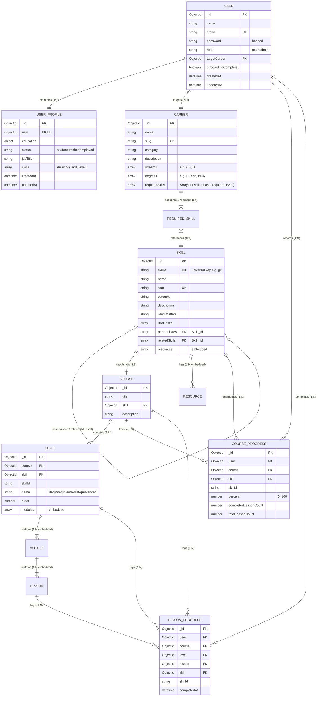

# 🚀 CareerGraph: System Architecture, Database Schema & Project Documentation

> **Intelligent IT Career Roadmap & Dynamic Skill Gap Platform**  
> Comprehensive Technical Specification, Entity-Relationship (ER) Modeling & System Documentation  
> **Version**: `1.0.0` | **Scope**: Full-Stack Capstone Engineering Project

---


## 📑 Table of Contents
1. [Executive Summary & Problem Statement](#1-executive-summary--problem-statement)
2. [System Architecture & High-Level Design](#2-system-architecture--high-level-design)
3. [Complete Entity-Relationship (ER) Diagram & Schema Modeling](#3-complete-entity-relationship-er-diagram--schema-modeling)
   - [3.1 Relational Cardinalities & Association Rules](#31-relational-cardinalities--association-rules)
   - [3.2 Mermaid Relational Diagram](#32-mermaid-relational-diagram)
   - [3.3 Comprehensive Data Dictionary (All 8 Entities)](#33-comprehensive-data-dictionary-all-8-entities)
4. [Core Algorithms & Domain Business Logic](#4-core-algorithms--domain-business-logic)
   - [4.1 Dynamic Roadmap Assembly & Gap Calculation](#41-dynamic-roadmap-assembly--gap-calculation)
   - [4.2 Topological Prerequisite & Phase Locking Engine](#42-topological-prerequisite--phase-locking-engine)
   - [4.3 Cross-Track Universal Progress Reflection](#43-cross-track-universal-progress-reflection)
   - [4.4 Hierarchical Progress Rollup Mechanics](#44-hierarchical-progress-rollup-mechanics)
5. [RESTful API Specifications](#5-restful-api-specifications)
6. [Frontend Architecture & Interactive Canvas UI](#6-frontend-architecture--interactive-canvas-ui)
7. [Security, Authentication & Data Protection](#7-security-authentication--data-protection)
8. [6-Member Team Module Workload Distribution](#8-6-member-team-module-workload-distribution)
9. [Setup, Execution & Operational Guide](#9-setup-execution--operational-guide)

---

## 1. Executive Summary & Problem Statement

### 1.1 The Industry Problem
In today's fast-moving software and IT industry, students, self-taught developers, and career switchers encounter an overwhelming paradox of choice:
- **Skill Ambiguity**: Aspiring developers often do not know which specific tools, frameworks, and proficiencies are expected by industry employers.
- **Prerequisite Confusion**: Without structured guidance, learners jump into high-level tools (such as React, Docker, or Kubernetes) before mastering fundamental prerequisites (such as JavaScript execution contexts or CLI/Git workflows).
- **Static Diagrams**: Traditional roadmap platforms provide static, non-interactive visual guides that fail to assess what the user already knows.
- **Isolated Progress**: Learning a core competency (e.g., Python or SQL) in one learning path does not carry over when evaluating an adjacent career track.

### 1.2 The CareerGraph Solution
**CareerGraph** is an interactive, personalized IT career roadmap platform inspired by roadmap.sh. It structures learning into a 5-tier hierarchy: **Career Track → Skills → Courses → Levels/Modules → Lessons**.

The system dynamically calculates the learner's skill gap based on self-assessment and lesson completions, locking advanced phases until prerequisites are mastered, and recognizing skills universally across different career paths.

---

## 2. System Architecture & High-Level Design

CareerGraph employs a decoupled 3-tier architecture:

```
┌─────────────────────────────────────────────────────────────┐
│                      PRESENTATION TIER                      │
│  • Vue 3 (Composition API, <script setup>), Vite 5.3        │
│  • Pinia 2.1 Centralized Stores (auth, roadmap, user)       │
│  • SVG Bezier Curve Interactive Canvas (Roadmap.vue)        │
│  • Slide-out Topic Preview Drawer & Career Switcher Modal   │
└──────────────────────────────┬──────────────────────────────┘
                               │  HTTPS / REST API (Axios + JWT)
                               ▼
┌─────────────────────────────────────────────────────────────┐
│                      APPLICATION TIER                       │
│  • Node.js 18+ & Express.js 4.19 Framework                  │
│  • Stateless JWT Authentication & Bcrypt Password Hashing   │
│  • Algorithmic Graph Service (skillGapService.js)           │
│  • Hierarchical Progress Rollup (progressController.js)     │
└──────────────────────────────┬──────────────────────────────┘
                               │  Mongoose ODM 8.5
                               ▼
┌─────────────────────────────────────────────────────────────┐
│                      PERSISTENCE TIER                       │
│  • MongoDB Cluster (Atlas or Local Engine)                  │
│  • 8 Normalized Schemas with Cross-Referencing & Indexes    │
│  • Atomic Lesson Logs & Aggregated Course Progress          │
└─────────────────────────────────────────────────────────────┘
```

---

## 3. Complete Entity-Relationship (ER) Diagram & Schema Modeling

### 3.1 Relational Cardinalities & Association Rules
1. **User (1) ↔ (1) UserProfile**: Each user has exactly one corresponding profile holding educational history, employment status, and declared skill proficiencies.
2. **User (N) ↔ (1) Career**: Multiple users can pursue the same target career path (`user.targetCareer` references `Career._id`).
3. **Career (N) ↔ (M) Skill**: Careers require multiple skills, and skills appear across multiple careers. This is modeled using an embedded `requiredSkills` subdocument array defining target proficiency and phase allocation (`foundations`, `core`, `advanced`).
4. **Skill (M) ↔ (N) Skill (Self-Reference)**: A skill references prerequisite skills and related adjacent skills via ObjectId arrays.
5. **Skill (1) ↔ (1) Course ↔ (N) Level**: A skill connects to a course, which is structured into progressive levels (`Beginner`, `Intermediate`, `Advanced`), each containing modules and atomic lessons.
6. **User (1) ↔ (N) CourseProgress & LessonProgress**: User completions are tracked per lesson and aggregated into course percentages with compound unique indexes.

---

### 3.2 Mermaid Relational Diagram



> **Visual Diagram Asset**: A high-resolution 300 DPI architectural render of this diagram is stored at [docs/er_diagram.png](file:///Users/architsurve/Desktop/careergraph/docs/er_diagram.png) and embedded directly into the Microsoft Word documentation [CareerGraph_Project_Documentation.docx](file:///Users/architsurve/Desktop/careergraph/CareerGraph_Project_Documentation.docx).

---

### 3.3 Comprehensive Data Dictionary (All 8 Entities)

#### 1. Entity: `User` (`users` collection)
| Field | Type | Constraints | Default / Reference | Description |
| :--- | :--- | :--- | :--- | :--- |
| `_id` | `ObjectId` | PK, Required | Auto-generated | Unique system identifier for user. |
| `name` | `String` | Required, Trim | None | Full display name. |
| `email` | `String` | Required, Unique, Lowercase | None | Unique authentication credential. |
| `password` | `String` | Required, `select: false` | None | Bcrypt password hash (10 salt rounds). |
| `role` | `String` | Enum: `'user'`, `'admin'` | `'user'` | Role-based authorization tier. |
| `targetCareer` | `ObjectId` | Optional | `Ref: Career` | Current career roadmap target. |
| `onboardingComplete`| `Boolean` | Required | `false` | Indicates initial assessment status. |

#### 2. Entity: `UserProfile` (`userprofiles` collection)
| Field | Type | Constraints | Default / Reference | Description |
| :--- | :--- | :--- | :--- | :--- |
| `_id` | `ObjectId` | PK, Required | Auto-generated | Unique profile document identifier. |
| `user` | `ObjectId` | Required, Unique (1:1) | `Ref: User` | Direct link to owner user account. |
| `education` | `Subdocument` | Optional | `{ degree, field, gradYear, stillStudying }` | Academic background. |
| `status` | `String` | Enum: `'student'`, `'fresher'`, `'employed'` | None | Current employment status. |
| `jobTitle` | `String` | Optional, Trim | None | Job title if employed. |
| `skills` | `Array<Subdocument>` | Default: `[]` | `[ { skill: Ref<Skill>, level: 0..4 } ]` | Declared baseline skill proficiencies. |

#### 3. Entity: `Career` (`careers` collection)
| Field | Type | Constraints | Default / Reference | Description |
| :--- | :--- | :--- | :--- | :--- |
| `_id` | `ObjectId` | PK, Required | Auto-generated | Career track primary key. |
| `name` | `String` | Required, Trim | None | Career title (e.g., Full Stack Developer). |
| `slug` | `String` | Required, Unique, Lowercase | None | URL slug identifier. |
| `category` | `String` | Trim | None | Category (e.g., Software Engineering). |
| `description` | `String` | Text | None | Detailed role overview. |
| `streams` | `Array<String>` | Default: `[]` | e.g. `['Computer Science', 'IT']` | Eligible college streams. |
| `degrees` | `Array<String>` | Default: `[]` | e.g. `['B.Tech', 'BCA']` | Eligible college degrees. |
| `requiredSkills` | `Array<Subdocument>` | Required | `[ { skill, skillId, slug, requiredLevel, phase } ]` | Skill requirements, phases, and target levels. |

#### 4. Entity: `Skill` (`skills` collection)
| Field | Type | Constraints | Default / Reference | Description |
| :--- | :--- | :--- | :--- | :--- |
| `_id` | `ObjectId` | PK, Required | Auto-generated | Primary key. |
| `skillId` | `String` | Required, Unique, Trim | e.g., `'git'`, `'python'` | Universal cross-track identifier. |
| `name` | `String` | Required, Trim | None | Human readable skill name. |
| `slug` | `String` | Required, Unique | None | URL slug identifier. |
| `category` | `String` | Trim | None | Technical classification. |
| `description` | `String` | Text | None | Conceptual summary. |
| `whyItMatters` | `String` | Text | None | Industry importance explanation. |
| `useCases` | `Array<String>` | Default: `[]` | None | Practical application scenarios. |
| `prerequisites` | `Array<ObjectId>` | Default: `[]` | `Ref: Skill` (Self) | Direct predecessor skills required. |
| `relatedSkills` | `Array<ObjectId>` | Default: `[]` | `Ref: Skill` (Self) | Lateral adjacent technologies. |
| `resources` | `Array<Subdocument>`| Default: `[]` | `[ { type, title, url, provider, isFree } ]` | Handpicked learning materials. |

#### 5. Entity: `Course` & `Level` (`courses` & `levels` collections)
| Field | Type | Constraints | Default / Reference | Description |
| :--- | :--- | :--- | :--- | :--- |
| `Course.title` | `String` | Required | None | Title of course curriculum. |
| `Course.skill` | `ObjectId` | Required | `Ref: Skill` | Associated target skill. |
| `Level.course` | `ObjectId` | Required | `Ref: Course` | Parent course reference. |
| `Level.name` | `String` | Enum: Beginner, Intermediate, Advanced | Required | Difficulty classification. |
| `Level.modules` | `Array<Subdoc>` | Embedded | `[ { title, lessons: [ { title, content, codeExample } ] } ]` | Nested modules and lessons. |

#### 6. Entity: `CourseProgress` & `LessonProgress` (`courseprogresses` & `lessonprogresses`)
| Field | Type | Constraints | Default / Reference | Description |
| :--- | :--- | :--- | :--- | :--- |
| `LessonProgress` | Model | Compound: `{ user: 1, lesson: 1 }` (UK) | References: User, Course, Level, Lesson | Atomic log of lesson completion. |
| `CourseProgress` | Model | Compound: `{ user: 1, course: 1 }` (UK) | References: User, Course, Skill | Aggregated course percent (0..100%). |
| `skillId` | `String` | Indexed | Universal string | Universal cross-track lookup key. |

---

## 4. Core Algorithms & Domain Business Logic

The core calculation logic resides in [backend/src/services/skillGapService.js](file:///Users/architsurve/Desktop/careergraph/backend/src/services/skillGapService.js).

### 4.1 Dynamic Roadmap Assembly & Gap Calculation (`buildRoadmap`)
When a user requests their roadmap for a career:
1. Loads Career requirements and populates prerequisite references.
2. Retrieves user declared skill proficiencies from `UserProfile.skills`.
3. Loads progress records from `CourseProgress` matching by `course`, `skill`, or universal `skillId`.
4. Determines skill node status:
   - **`completed`** (100%): if course progress = 100% OR user declared level >= 3 (`'Know everything'`).
   - **`in_progress`**: if declared level > 0 OR course progress > 0.
   - **`not_started`** (0%): default state.
5. Groups nodes into chronological phases: **Phase 1: Foundations**, **Phase 2: Core Stack**, **Phase 3: Advanced & Ecosystem**.

### 4.2 Topological Prerequisite & Phase Locking Engine (`computeUnlockedPhases`)
To enforce structured learning without skipping fundamentals:
- **Phase 1** is unconditionally unlocked at the phase level.
- **Phase 2** is locked if any skill in Phase 1 remains incomplete (`isLocked = true`, showing `Complete all skills in Phase 1: Foundations first`).
- **Phase 3** is locked if any skill in Phase 2 remains incomplete.
- Within an unlocked phase, individual nodes are locked if any explicit prerequisite skill is not marked `completed`.
- The system automatically assigns the **`recommended`** property to the first non-locked, non-completed node.

### 4.3 Cross-Track Universal Progress Reflection
Because `CourseProgress` and `LessonProgress` record universal `skillId` strings (e.g., `git`, `python`):
- Progress earned in one career track (e.g., *Full Stack Developer*) automatically carries over when switching to an adjacent career track (e.g., *DevOps Engineer* or *AI/ML Engineer*).
- When a user finishes all lessons for a skill (100%), their `UserProfile.skills` entry is automatically elevated to level 4 (Expert).

### 4.4 Hierarchical Progress Rollup Mechanics (`recalculateCourseProgress`)
Whenever a learner ticks or unticks a lesson:
1. The backend records or deletes the corresponding `LessonProgress` record.
2. Traverses the course curriculum hierarchy (`Course → Level → Module → Lesson`) to count total lessons.
3. Calculates `percent = (completedLessons / totalLessons) * 100`.
4. Atomically updates `CourseProgress` with `{ percent, completedLessonCount, totalLessonCount }`.

---

## 5. RESTful API Specifications

| Method | Endpoint URI | Auth | Request Payload | Response Data |
| :--- | :--- | :--- | :--- | :--- |
| `POST` | `/api/auth/register` | Public | `{ name, email, password }` | User object and JWT token |
| `POST` | `/api/auth/login` | Public | `{ email, password }` | User object and JWT token |
| `GET` | `/api/auth/me` | Bearer JWT | None | Current authenticated user profile |
| `GET` | `/api/careers` | Optional | Query: `?stream=&degree=&category=` | List of matching career tracks |
| `GET` | `/api/careers/:slug`| Optional | None | Career details with populated skills |
| `GET` | `/api/skills/:skillId`| Optional | None | Skill details, resources, and prerequisites |
| `GET` | `/api/roadmap` | Bearer JWT | None | Dynamic roadmap with phases, locks, and recommendations |
| `GET` | `/api/roadmap/:careerId` | Bearer JWT | None | Dynamic roadmap for specified career track |
| `PUT` | `/api/progress/skill/:id/status` | Bearer JWT | `{ status: 'completed' }` | Updated skill status and roadmap rollup |
| `POST` | `/api/progress/toggle-lesson` | Bearer JWT | `{ lessonId, courseId }` | Updated lesson state and course progress percentage |

---

## 6. Frontend Architecture & Interactive Canvas UI

The frontend is implemented in Vue 3 using the Composition API:
- **Interactive SVG Canvas ([Roadmap.vue](file:///Users/architsurve/Desktop/careergraph/frontend/src/views/Roadmap.vue))**:
  - Organized into 3 visual phase columns.
  - Dynamically calculates SVG cubic bezier paths connecting prerequisite nodes to target nodes.
  - Quick badge toggling (cycles `not_started` ➔ `in_progress` ➔ `completed` with 1 click).
  - Custom right-click context menu for direct status selection.
  - Padlock indicator (🔒) with tooltip explaining unmet prerequisites.
- **Topic Preview Drawer ([SkillPreviewDrawer.vue](file:///Users/architsurve/Desktop/careergraph/frontend/src/components/SkillPreviewDrawer.vue))**:
  - Slides out within the canvas when clicking any node.
  - Displays description, industry importance, curated video/documentation resources, and interactive lesson checklist.
- **Career Switcher Modal ([CareerSwitchModal.vue](file:///Users/architsurve/Desktop/careergraph/frontend/src/components/CareerSwitchModal.vue))**:
  - Allows in-place switching of career tracks with real-time stream filtering and search.
- **Onboarding Assessment Wizard ([Onboarding.vue](file:///Users/architsurve/Desktop/careergraph/frontend/src/views/Onboarding.vue))**:
  - 4-step wizard capturing academic background, career goal, and baseline ratings.
- **Pinia State Architecture**:
  - `auth.js`: User session, authentication token persistence.
  - `roadmap.js`: Active graph nodes, phases, completion percentages, next recommended skill.
  - `user.js`: User profile data and academic stream preferences.

---

## 7. Security, Authentication & Data Protection

1. **Bcrypt Password Encryption**: User passwords are encrypted with 10 salt rounds prior to database insertion using Mongoose `pre('save')` hooks.
2. **Stateless JWT Authorization**: API routes are protected with `authMiddleware.js`, validating `Bearer <token>` headers without storing server-side sessions.
3. **Database Projection Protection**: Sensitive fields like `password` and `__v` are set to `select: false` in the schema and explicitly stripped via `toSafeObject()` and `toJSON` transforms.
4. **Race Condition Prevention**: Compound indexes (`{ user: 1, course: 1 }` and `{ user: 1, lesson: 1 }`) guarantee idempotency during rapid user interactions.

---

## 8. 6-Member Team Module Workload Distribution

For academic capstone presentation and project defense, the responsibilities are distributed across 6 specialized modules:

| Member / Role | Module Responsibility | Specific Technical Deliverables |
| :--- | :--- | :--- |
| **Member 1**<br>Lead Backend & Security | **Auth & User Identity Architecture** | • `User` and `UserProfile` Mongoose schemas<br>• Bcrypt hashing and sanitization pre-save hooks<br>• JWT authentication and route protection middleware<br>• User profile and account management controllers |
| **Member 2**<br>Graph Algorithms Lead | **Skill Gap & Prerequisite Engine** | • Design and implementation of `skillGapService.js`<br>• Phase categorization (Foundations, Core, Advanced)<br>• Topological prerequisite validation & phase lock logic<br>• Universal cross-track skill progress calculation |
| **Member 3**<br>Data Architect & Seeder | **Curriculum & Database Modeling** | • Schemas for `Career`, `Skill`, `Course`, `Level`, `Progress`<br>• Complete curriculum seeding script (`src/seed/seed.js`)<br>• MongoDB compound indexing for sub-millisecond queries<br>• Academic stream and degree category mapping |
| **Member 4**<br>Lead Frontend Engineer | **Roadmap Canvas & Visual Graph** | • Interactive canvas engine in `Roadmap.vue`<br>• SVG cubic bezier curve connection algorithms<br>• Quick status toggle badge system & right-click context menu<br>• Responsive pan, drag, and phase column layout |
| **Member 5**<br>UI/UX & Workflow Lead | **Assessment, Onboarding & Modals** | • Guided multi-step assessment wizard (`Onboarding.vue`)<br>• In-place `CareerSwitchModal` with stream filters<br>• Slide-out topic preview drawer (`SkillPreviewDrawer.vue`)<br>• Dashboard completion indicators and metrics |
| **Member 6**<br>State & API Lead | **Pinia State Integration & QA** | • Pinia store implementation (`auth.js`, `roadmap.js`, `user.js`)<br>• Centralized Axios API service with JWT interceptors<br>• Optimistic UI state updates and server synchronization<br>• Production build verification and responsive CSS styling |

---

## 9. Setup, Execution & Operational Guide

### 9.1 Backend Setup
```bash
cd backend
npm install
```
Configure `backend/.env`:
```env
PORT=5001
MONGO_URI=mongodb://localhost:27017/careergraph
JWT_SECRET=your_super_secret_jwt_key
```
Seed database and run API server:
```bash
npm run seed
npm run dev
```
*(Backend runs at `http://localhost:5001`)*

### 9.2 Frontend Setup
```bash
cd frontend
npm install
```
Configure `frontend/.env`:
```env
VITE_API_BASE_URL=http://localhost:5001/api
```
Start Vite development server:
```bash
npm run dev
```
*(Frontend runs at `http://localhost:5173`)*
